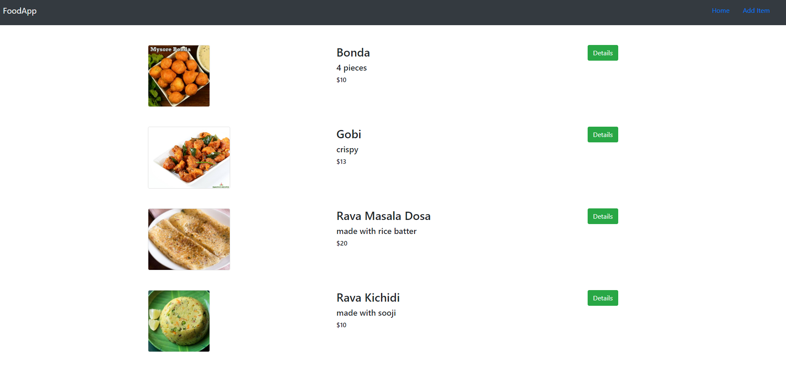
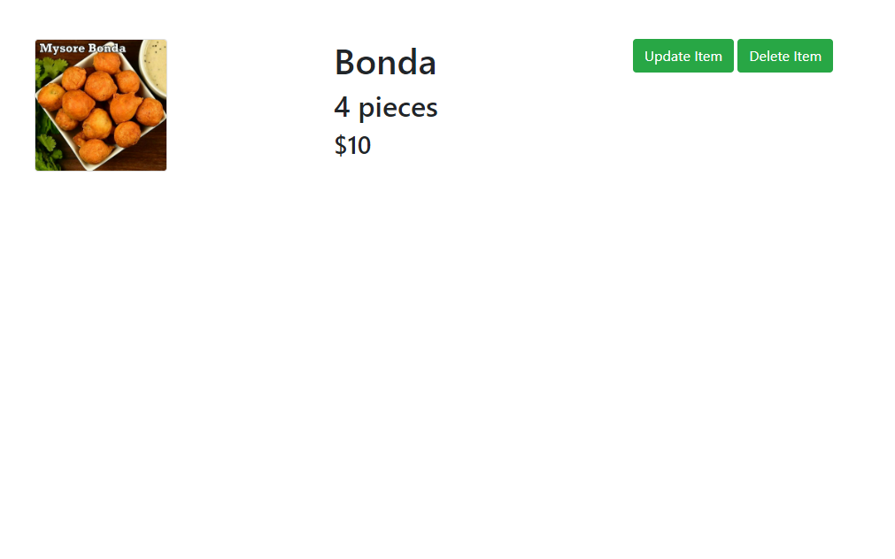
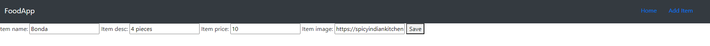
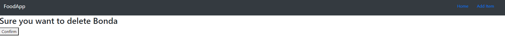

# Food App README


Welcome to the Food App! FoodApp is a Django web application for managing food items. It allows you to add, update, and delete food items, as well as view their details.
## Table of Contents

- Prerequisites and Installation
- Usage
- Project Structure
- Visual Walkthrough of the Web App


Make sure you have the following dependencies installed:

- Python (3.6 or higher)
- Django (4.2.2)
- Virtual environment (optional but recommended)

## Prerequisites

You can install these dependencies using the following command:

```bash
pip install -r requirements.txt
```
1. Clone the repository:

```bash
git clone https://github.com/nanihemanth/Food-App
cd Food-App
```
2. Set up a virtual environment (optional but recommended):

```bash
python -m venv venv
source venv/bin/activate
```
3. Apply database migrations::

```bash
python manage.py migrate
```
4. Set up a virtual environment (optional but recommended):

```bash
python -m venv venv
source venv/bin/activate
```

5. Create a superuser (admin) account:

```bash
python manage.py createsuperuser
```

6. Start the development server:

```bash
python manage.py runserver
```


## Usage

- Access the admin interface
     - Open your web browser and navigate to http://127.0.0.1:8000/admin/
     - Log in using the superuser account created earlier.
- Manage Food Items
     - Add Food Items: Click on "Add Item" to create new food items.
     - View Food Items: Navigate to the homepage at http://127.0.0.1:8000/food/ to see a list of available food items.
     - Update Food Items: Click on "Update Item" on the food item's detail page to modify its information.
     - Delete Food Items: Click on "Delete Item" on the food item's detail page to remove it from the database
 
## Project Structure

```
+-- FoodApp/                      # Root Folder
   +--food                        # app name
      +--migrations/              # database migrations files(changes)
      +--static                   # folder to store stataic files like images,css
         +--food                  # app name
            +--style.css          # css file for styling          
      +--templates                # templates folder to store html files
         +--food                  # app name
            +--base.html          # Template for all the pages
            +--detail.html        # Template for displaying food item details
            +--index.html         # Template for listing food items
            +--item-delete.html   # Template for confirming item deletion
            +--item-form.html     # Template for creating/updating food items
      +--__init.py__
      +--admin.py                 # admin python file to register the models(database)
      +--apps.py                  # apps file
      +--forms.py                 # file defines forms used in the app
      +--models.py                # file defines the Item model
      +--urls.py                  # file defines app-specific URLs and routing
      +--views.py                 # views file to process the request sent from url
   +--project                     # file contains the view functions for the app
      +--__init.py
      +--asgi.py
      +--settings.py              # configuration(apps,database etc)
      +--urls.py                  # urls file
      +--wsgi.py
   +--Readme.md                   # readme file
   +--db.sqlite3                  # SQLite database file (for development)
   +--manage.py                   # to run the server
   +--requirements.txt            # list of dependencies
   +--License                     # license file
   ```
In this example, the project is named FoodApp, and it contains a Django app named food for managing food items. The project directory contains the main project configuration, such as settings, URLs, and the WSGI application entry point.

The static directory holds project-wide static files, and the templates directory contains project-wide templates, including a base template that other templates can extend.

The manage.py file is Django's command-line utility for managing the project, and db.sqlite3 is the SQLite database file (for development purposes).


## Visual Walkthrough of the Web App

HOME PAGE
	
DETAIL PAGE
	
UPDATE PAGE
	
ADD PAGE
	
DELETE PAGE
	


## Contributing

Contributions to the FoodApp are welcome. If you encounter any bugs, have suggestions for improvements, or want to add new features, please open an issue or submit a pull request to the repository.

## License

This project is licensed under the [MIT](LICENSE).
